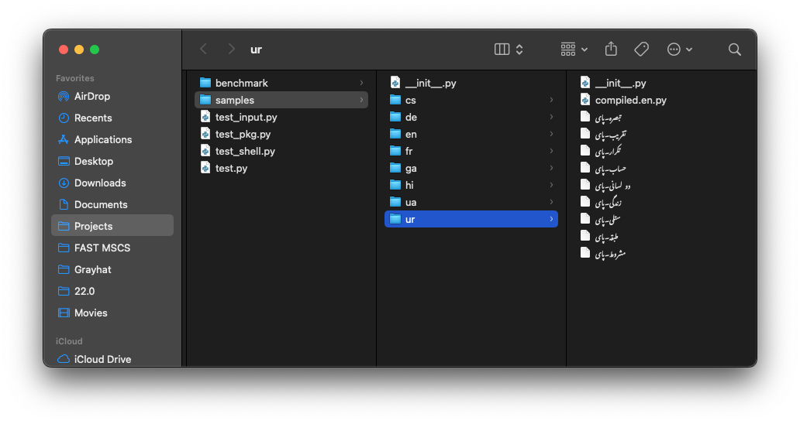

Using Your Native Language
==========================

UniversalPython supports writing Python code with keywords and standard library functions translated into your native language.

Supported Languages and Extensions
----------------------------------

UniversalPython supports multiple languages through language-specific extensions.

For example:

- English (default, no extension needed)
- French (`<filename>.fr.py`)
- Chinese (`<filename>.zh.py`)
- German (`<filename>.de.py`)
- And many more (see the full list in the **Supported Languages** section)

Each language extension provides the necessary translations for Python keywords, built-in functions, and standard library aliases.

